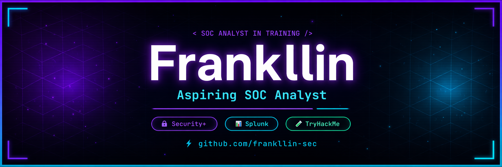

# 🛡️ My Cybersecurity Journey

Documenting my path toward becoming to  Cyber Security Word.
 
 

  

  

## 📊 Progress

- ✅ Pre Security Path
- ⬜ Cyber Security 101
- ⬜ SOC 1
- ⬜ Splunk Core Certified User
- ⬜ CompTIA Security+

<!--
**frankllin-sec/frankllin-sec** is a ✨ _special_ ✨ repository because its `README.md` (this file) appears on your GitHub profile.

Here are some ideas to get you started:

- 🔭 I’m currently working on ...
- 🌱 I’m currently learning ...
- 👯 I’m looking to collaborate on ...
- 🤔 I’m looking for help with ...
- 💬 Ask me about ...
- 📫 How to reach me: ...
- 😄 Pronouns: ...
- ⚡ Fun fact: ...
-->
